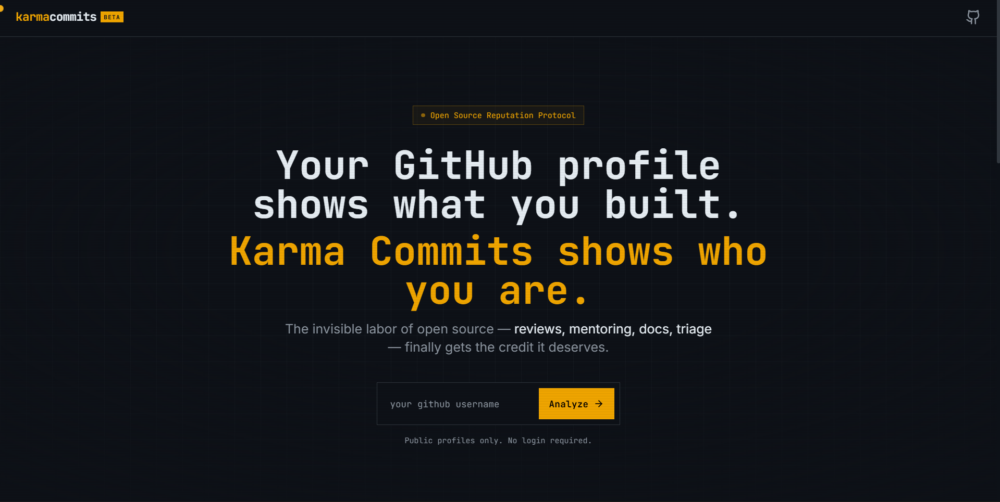

# ⚡ Karma Commits

> **Your GitHub OSS Reputation Passport** — Beyond commits. Track reviews, mentoring, docs, and bug triage. Get your open-source reputation score AND an AI-powered code review.

[](https://nextjs.org)
[](https://www.typescriptlang.org)
[](https://tailwindcss.com)
[](https://groq.com)
[](https://karma-commits.vercel.app)

---

## Preview

### Dashboard

*Dashboard featuring Karma Score, reputation radar chart, badges, and shareable passport card*

> **Dashboard Highlights:**
> - **Karma Score (0–1000)** — Your overall reputation score with 5 dimension breakdown
> - **Reputation Radar** — Interactive 5D visualization of your contributions
> - **Achievement Badges** — 18+ earned badges based on your contribution patterns
> - **Karma Passport** — Downloadable PNG card to share your score
> - **Account Stats** — Followers, public repos, member since
> - **AI Review Button** — Quick access to get Groq AI code feedback

---

## ✨ Features

| Feature | Description |
|---|---|
| **Karma Score (0–1000)** | Composite score across 5 weighted dimensions |
| **5 Reputation Dimensions** | Code Quality, Collaboration, Mentorship, Documentation, Consistency |
| **6 Karma Tiers** | Seed → Sprout → Contributor → Maintainer → Luminary → Legend |
| **Shareable Passport Card** | Downloadable PNG card with radar chart, tier badge, and earned badges |
| **AI Code Review** | Groq-powered analysis of your code with personality type & improvements |
| **18+ Achievement Badges** | Earn badges for specific contribution patterns (prolific reviewer, doc guardian, mentor, etc.) |
| **Interactive Radar Chart** | 5D visualization of your reputation dimensions |
| **Community Leaderboard** | Filterable leaderboard sorted by Overall, Reviewer, Builder, Mentor, Bug Hunter, Documentor |
| **10-Minute API Cache** | In-memory cache to protect against GitHub API rate limits |
| **Rate Limit Handling** | Live countdown UI when GitHub API limits are hit |
| **Loading Screens** | Beautiful animated loading screens after entering a username |
| **Custom GitHub-Dark Theme** | Inspired by GitHub's dark UI with amber accent colors |
| **No Login Required** | Analyze any public GitHub profile without authentication |
| **OG / Twitter Cards** | Auto-generated social sharing cards |

---

## 🎯 User Flow

1. **Home Page** → Enter any GitHub username (no login required)
2. **Loading Screen** → App analyzes public contributions (1–5 seconds)
3. **Dashboard** → See your Karma Score, radar chart, badges, and passport card
4. **AI Review** → Click "✦ AI Review" to get Groq AI feedback on your code
5. **Share** → Download passport or share on social media

---

## 📊 Karma Score System

### 5 Dimensions (0–100 each)

| Dimension | Color | Signals | Weight |
|---|---|---|---|
| 🔨 **Code Quality** | Amber | PRs merged, stars, repos contributed | 25% |
| 👥 **Collaboration** | Emerald | PR reviews, issues closed, discussions | 25% |
| 🎓 **Mentorship** | Sky | Reviews given, issue guidance, followers | 20% |
| 📖 **Documentation** | Violet | Discussions, READMEs, docs commits | 15% |
| 📈 **Consistency** | Rose | Contribution streaks, commit frequency | 15% |

**Final Score = (Code Quality × 0.25 + Collaboration × 0.25 + Mentorship × 0.2 + Documentation × 0.15 + Consistency × 0.15) × 10**

### 6 Tiers

| Tier | Score Range | Label |
|---|---|---|
| 🌱 Seed | 0–99 | Apprentice |
| 🌿 Sprout | 100–249 | Apprentice |
| 🌱 Contributor | 250–449 | Contributor |
| ⚙️ Maintainer | 450–649 | Maintainer |
| ⚡ Luminary | 650–799 | Veteran |
| 👑 Legend | 800–1000 | Legend |

### 5 Category Scores (for Leaderboard Filtering)

- 🔨 **Builder** — Raw code output (commits + merged PRs)
- 👁️ **Reviewer** — Review quality & frequency
- 🐛 **Bug Hunter** — Issues opened + closed
- 📖 **Documentor** — Documentation commits
- 🎓 **Mentor** — Mentoring & first-timer help

---

## 🛠 Tech Stack

| Layer | Technology |
|---|---|
| **Framework** | [Next.js 14](https://nextjs.org) (App Router) |
| **Language** | TypeScript 5 |
| **Styling** | Tailwind CSS 3 + custom GitHub-dark tokens |
| **GitHub API** | [@octokit/rest](https://github.com/octokit/rest.js) |
| **AI** | [Groq SDK](https://groq.com) for ultra-fast LLM inference |
| **Charts** | [Recharts](https://recharts.org) (Radar chart) |
| **Animations** | [Framer Motion](https://www.framer.com/motion) |
| **Export** | [html-to-image](https://github.com/bubkoo/html-to-image) (PNG download) |
| **Icons** | [Lucide React](https://lucide.dev) |
| **Deployment** | [Vercel](https://vercel.com) |

---

## 📁 Project Structure

```
karma-commits/
├── app/                              # Next.js App Router
│   ├── layout.tsx                    # Root layout
│   ├── page.tsx                      # Landing page with hero & CTA
│   ├── globals.css                   # Global styles & Tailwind base
│   ├── error.tsx & global-error.tsx  # Error boundaries
│   │
│   ├── dashboard/
│   │   └── page.tsx                  # Karma Score dashboard with radar, badges, passport
│   │
│   ├── leaderboard/
│   │   └── page.tsx                  # Community leaderboard (filterable, sortable)
│   │
│   ├── ai-review/
│   │   └── page.tsx                  # AI code review results (Groq-powered)
│   │
│   └── api/
│       ├── github/
│       │   └── route.ts              # GET /api/github?username=...
│       │
│       ├── ai-review/
│       │   └── route.ts              # GET /api/ai-review?username=...
│       │
│       └── leaderboard/
│           └── route.ts              # GET + POST /api/leaderboard
│
├── components/                       # Reusable UI components
│   ├── PassportCard.tsx              # Downloadable karma passport (PNG export)
│   ├── KarmaScore.tsx                # Score display with dimensions
│   ├── RadarChart.tsx                # 5D radar visualization
│   ├── BadgeShelf.tsx                # Badge grid (earned & locked)
│   ├── LeaderboardTable.tsx          # Leaderboard rows
│   ├── AIReviewError.tsx             # AI review error states
│   ├── LoadingScreen.tsx             # Full-screen loading overlay
│   ├── DashboardSkeleton.tsx         # Dashboard loading skeleton
│   ├── LeaderboardSkeleton.tsx       # Leaderboard loading skeleton
│   ├── ErrorBoundary.tsx             # Error boundary wrapper
│   └── ui/
│       ├── CustomCursor.tsx          # Ambient cursor effect
│       └── ...
│
├── lib/                              # Core business logic
│   ├── karmaEngine.ts                # Score calculation & badges
│   ├── githubFetcher.ts              # GitHub data fetching (Octokit)
│   ├── aiReviewer.ts                 # Groq AI review logic
│   ├── leaderboard.ts                # Leaderboard management (file-based)
│   └── types.ts                      # TypeScript types & interfaces
│
├── data/
│   └── leaderboard.json              # Persistent leaderboard store
│
├── .env.local                        # Environment variables (GITHUB_TOKEN, GITHUB_CLIENT_ID, etc.)
├── next.config.mjs                   # Next.js config
├── tailwind.config.ts                # Tailwind design tokens
├── tsconfig.json                     # TypeScript config
└── package.json                      # Dependencies
```

---

## 🚀 Getting Started

### Prerequisites

- Node.js 18+
- A GitHub account
- (Optional) Groq API key for AI Review feature

### 1. Clone the repository

```bash
git clone https://github.com/your-username/karma-commits.git
cd karma-commits
```

### 2. Install dependencies

```bash
npm install
```

### 3. Create a GitHub Personal Access Token

1. Go to **github.com → Settings → Developer settings → Personal access tokens → Tokens (classic)**
2. Click **"Generate new token (classic)"**
3. Set expiration to 90 days
4. Select scopes: `public_repo` and `read:user`
5. Click **"Generate token"** and copy it

### 4. Set up environment variables

Create a `.env.local` file in the project root:

```env
# GitHub API Token (for fetching user data)
GITHUB_TOKEN=ghp_xxxxxxxxxxxxxxxxxxxxxxxxxxxx

# (Optional) Groq API Key for AI Code Review
GROQ_API_KEY=gsk_xxxxxxxxxxxxxxxxxxxxxxxxxxxx
```

**Note:** You can get a free Groq API key at [console.groq.com](https://console.groq.com)

### 5. Run the development server

```bash
npm run dev
```

Open [http://localhost:3000](http://localhost:3000) in your browser.

---

## 🎮 How to Use

### View Your Karma Score

1. On the home page, enter your GitHub username
2. Click **"Analyze"**
3. Wait for the loading screen (1–5 seconds)
4. See your Karma Score, radar chart, badges, and passport card on the dashboard

### Get an AI Code Review

1. On the dashboard, click **"✦ AI Review"** in the top navigation
2. The app analyzes your top repositories using Groq AI
3. Get instant feedback on:
   - Overall code quality score
   - Your developer personality (Pragmatist, Perfectionist, Architect, etc.)
   - Key strengths in your code
   - Actionable improvements
   - Shareable report card

### Check the Leaderboard

Click **"Leaderboard"** to see the top open-source contributors ranked by:
- Overall Karma Score
- Reviewer (code review focus)
- Builder (code output)
- Mentor (mentoring others)
- Bug Hunter (issue triage)
- Documentor (documentation)

---

## 📡 API Routes

| Endpoint | Method | Description |
|---|---|---|
| `GET /api/github?username=...` | GET | Fetch & score a user's GitHub stats (10-min cache) |
| `GET /api/ai-review?username=...` | GET | Get Groq AI code review feedback |
| `GET /api/leaderboard?sort=...` | GET | Get leaderboard sorted by score type |
| `POST /api/leaderboard` | POST | Upsert a user's leaderboard entry |

---

## 📦 Build & Deploy

### Build for production

```bash
npm run build
```

### Start production server

```bash
npm start
```

### Deploy to Vercel

1. Push your repo to GitHub
2. Go to [vercel.com/new](https://vercel.com/new) and import your repo
3. Add environment variables:
   - `GITHUB_TOKEN`
   - `GROQ_API_KEY` (optional)
4. Deploy!

> **Note on Persistence:** The leaderboard uses a file-based store. On Vercel's serverless infrastructure, files don't persist across deployments. For production, migrate `lib/leaderboard.ts` to a database (Vercel KV, PlanetScale, Supabase, etc.).

---

## 🎨 Design System

Custom **GitHub-dark** color palette (defined in `tailwind.config.ts`):

| Token | Hex | Usage |
|---|---|---|
| `gh-bg` | `#0d1117` | Page background |
| `gh-surface` | `#161b22` | Cards & panels |
| `gh-border` | `#30363d` | Borders |
| `gh-muted` | `#8b949e` | Secondary text |
| `gh-text` | `#e6edf3` | Primary text |
| `amber` | `#f0a500` | Brand accent (scores, CTAs) |
| `emerald` | `#10b981` | Collaboration |
| `sky` | `#38bdf8` | Mentorship |
| `violet` | `#a78bfa` | Documentation |
| `rose` | `#f43f5e` | Consistency |

---

## 🐛 Troubleshooting

### `Server configuration error` on dashboard

**Cause:** `GITHUB_TOKEN` is not set in `.env.local`

**Fix:** Add your GitHub PAT to `.env.local` and restart the dev server

### `404 (Not Found)` errors

Make sure your GitHub token has the correct scopes: `public_repo` and `read:user`

### AI Review takes too long

The AI review analyzes your top repositories, which can take 10–15 seconds. This is normal.

### Leaderboard not updating

The leaderboard is file-based (`data/leaderboard.json`). On local dev, it should update when you analyze a user. On Vercel, see the production persistence note above.

---

## 📝 License

MIT

---

## 🙏 Contributing

Contributions are welcome! Feel free to:

- Report bugs via GitHub issues
- Submit pull requests for improvements
- Suggest new features or badges
- Improve documentation

---

**Built with ❤️ for the open source community**
